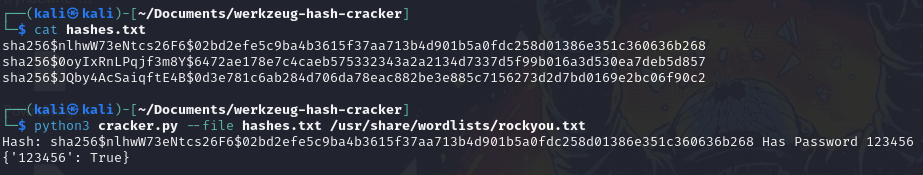

# werkzeug-hash-cracker
A script to crack `werkzeug.security` generated hashes

[](https://opensource.org/licenses/MIT)
[](https://github.com/Tanzania-Developers-Community/made-in-tanzania)

### What Is Werkzeug Security Helper

Werkzeug allows you to access their security helpers which generate a hash either using scrypt or using pbkdf2

### Creating Hashes Using Werkzeug Security Helper

To create a hash using werkzeug is very simple and straightforward,

**Installing Werkzeug Via PIP**

```commandline
pip install werkzeug
```

**Creating The Hash**

```python
In [1]: from werkzeug.security import generate_password_hash

In [2]: password = "admin1234"

In [3]: hashed_password = generate_password_hash(password, 'sha256')

In [4]: print(hashed_password)
sha256$JQby4AcSaiqftE4B$0d3e781c6ab284d706da78eac882be3e885c7156273d2d7bd0169e2bc06f90c2
```

**Confirming The Hash**

```python
In [1]: from werkzeug.security import check_password_hash

In [2]: hashed_password = "sha256$JQby4AcSaiqftE4B$0d3e781c6ab284d706da78eac882be3e885c7156273d2d7bd0169e2bc06f90c2"

In [3]: check_password = check_password_hash(hashed_password, "admin1234")

In [4]: print(check_password)
True
```

### Using The Script

The script's usage are as seen below:

```commandline
usage: cracker.py [-h] [--single hash wordlist] [--file hashfile wordlist] [--about]

Werkzeug Security Hash Cracker :: @tahaafarooq

options:
  -h, --help            show this help message and exit
  --single hash wordlist
                        Crack a single hash string
  --file hashfile wordlist
                        Crack a file with multiple hashes
  --about               Print core information about the script and developer
```

##### Cracking Single Hash

```shell
python3 cracker.py --single "sha256\$JQby4AcSaiqftE4B\$0d3e781c6ab284d706da78eac882be3e885c7156273d2d7bd0169e2bc06f90c2" /usr/share/wordlists/rockyou.txt
```


##### Cracking A File Of Hashes

```shell
python3 cracker.py --file hashes.txt /usr/share/wordlists/rockyou.txt
```



##### Getting About Information

```shell
python3 cracker.py --about
```

### Contribution

Just fork the repository, do some magic, and make a pull request :)

